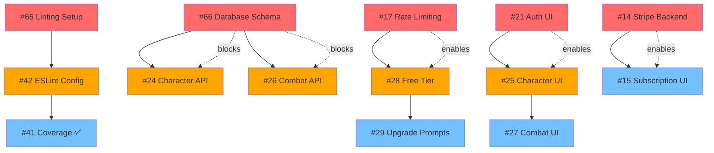

# D&D Encounter Tracker Execution Plan

**Version:** 1.0  
**Date:** July 2025  
**Based on:** Implementation Plan v5.0

## Table of Contents

### 🎯 Quick Navigation

- [🚨 Critical Dependencies](#critical-sequential-dependencies)
- [⚡ Phase Overview](#phase-execution-overview)
- [🔄 Parallel Work Streams](#parallel-work-opportunities)
- [🛡️ Risk Management](#risk-mitigation)
- [📊 GitHub Issues Index](#github-issues-index)

### 📋 Main Sections

1. [Executive Summary](#executive-summary)
2. [Critical Sequential Dependencies](#critical-sequential-dependencies)
3. [Phase 1: Foundation & Core Systems](#phase-1-foundation--core-systems)
4. [Phase 2: Core Features Implementation](#phase-2-core-features-implementation)
5. [Phase 3: Advanced Features & Monetization](#phase-3-advanced-features--monetization)
6. [Phase 4: Production Launch & Optimization](#phase-4-production-launch--optimization)
7. [Phase 5: Resilience & Continuity](#phase-5-resilience--continuity)
8. [Parallel Work Opportunities](#parallel-work-opportunities)
9. [Risk Mitigation](#risk-mitigation)

### 📊 Quick Reference Sections

- [GitHub Issues Index](#github-issues-index)
- [Dependency Visualization](#dependency-visualization)
- [Work Stream Coordination](#work-stream-coordination)
- [Success Metrics Dashboard](#success-metrics)

## Executive Summary

This execution plan maps the Implementation Plan to specific GitHub issues and provides a roadmap for coordinating development work across multiple engineers or AI agents. The plan identifies critical dependencies that must be completed sequentially and maximizes opportunities for parallel development.

### Key Metrics

- **Total Issues:** 81 (35 existing + 15 new + future planning)
- **Sequential Dependencies:** 5 critical chains identified
- **Parallel Work Streams:** Up to 4 simultaneous work tracks possible
- **Estimated Duration:** 10 weeks to production launch

### Critical Success Factors

1. **Sequential Dependencies** must be respected to avoid merge conflicts → [Dependency Chains](#critical-sequential-dependencies)
2. **Infrastructure First** - Foundation issues block all feature development → [Phase 1](#phase-1-foundation--core-systems)
3. **Database Schema** must be complete before API development → [Chain 3](#️-dependency-chain-3-database-foundation)
4. **Authentication System** must be working before any user-facing features → [Chain 2](#️-dependency-chain-2-authentication-foundation)

## Critical Sequential Dependencies

### ⚠️ DEPENDENCY CHAIN 1: Linting and Code Quality

**Issues must be completed in exact order:**

- [x] **[#65](https://github.com/dougis/dnd-tracker-node/issues/65)** - Setup Linting tools and automations ✅ **COMPLETED** → [Week 1](#week-1-infrastructure-foundation)
- [x] **[#42](https://github.com/dougis/dnd-tracker-node/issues/42)** - Re-enable ESLint checks and configure properly for monorepo ✅ **COMPLETED** → [Week 1](#week-1-infrastructure-foundation)
- [x] **[#41](https://github.com/dougis/dnd-tracker-node/issues/41)** - Set up Code coverage reporting to Codacy ✅ **COMPLETED** → [Code Quality](#code-quality-after-linting-chain)

**Risk:** All three modify core build configuration. Parallel work will cause merge conflicts.
**Mitigation:** [Linting Configuration Risk](#linting-configuration-risk-65-42-41)

### ⚠️ DEPENDENCY CHAIN 2: Authentication Foundation

**Rate limiting must complete before subscription systems:**

- [ ] **[#17](https://github.com/dougis/dnd-tracker-node/issues/17)** - Implement production-ready rate limiting → [Week 1](#parallel-track-c-security-foundation)
- [ ] **[#28](https://github.com/dougis/dnd-tracker-node/issues/28)** - Implement Free Tier Subscription Logic → [Week 3](#subscription-system-after-17)
- [ ] **[#29](https://github.com/dougis/dnd-tracker-node/issues/29)** - Build Frontend Usage and Upgrade Prompts → [Week 3](#subscription-system-after-17)

**Risk:** Subscription logic depends on rate limiting infrastructure.
**Mitigation:** [Authentication System Risk](#authentication-system-risk-17-21)

### ⚠️ DEPENDENCY CHAIN 3: Database Foundation

**Schema must be established before all API work:**

- [x] **[#66](https://github.com/dougis/dnd-tracker-node/issues/66)** - Design and implement comprehensive Prisma database schema ✅ **COMPLETED** → [Week 1](#critical-path-sequential)
- [ ] **[#24](https://github.com/dougis/dnd-tracker-node/issues/24)** - Implement Party and Character Management API → [Week 2](#backend-apis-after-66)
- [ ] **[#26](https://github.com/dougis/dnd-tracker-node/issues/26)** - Implement Combat System MVP Backend → [Week 2](#backend-apis-after-66)

**Risk:** API development impossible without database schema.
**Mitigation:** [Database Schema Risk](#database-schema-risk-66)

### ⚠️ DEPENDENCY CHAIN 4: Frontend Foundation

**Base UI components must exist before feature UIs:**

- [ ] **[#21](https://github.com/dougis/dnd-tracker-node/issues/21)** - Build frontend foundation and authentication UI → [Week 1](#parallel-track-c-security-foundation)
- [ ] **[#25](https://github.com/dougis/dnd-tracker-node/issues/25)** - Build frontend for Party and Character Management → [Week 2](#frontend-development-after-21)
- [ ] **[#27](https://github.com/dougis/dnd-tracker-node/issues/27)** - Build Frontend for Combat System MVP → [Week 2](#frontend-development-after-21)

**Risk:** Feature UIs depend on base component library and authentication.
**Mitigation:** [Authentication System Risk](#authentication-system-risk-17-21)

### ⚠️ DEPENDENCY CHAIN 5: Payment Integration

**Backend must be working before frontend:**

- [ ] **[#14](https://github.com/dougis/dnd-tracker-node/issues/14)** - Implement comprehensive Stripe integration → [Week 3](#payment-integration-sequential)
- [ ] **[#15](https://github.com/dougis/dnd-tracker-node/issues/15)** - Implement full subscription management UI → [Week 3](#payment-integration-sequential)

**Risk:** Frontend subscription UI cannot function without backend integration.
**Mitigation:** [Payment Integration Risk](#payment-integration-risk)

## Phase 1: Foundation & Core Systems

**Duration:** Week 1-2 | **Milestone:** 1.1 & 1.2

### Week 1: Infrastructure Foundation

**Focus:** Secure foundation and development environment

#### Critical Path (Sequential)

- [x] **#65** - Setup Linting tools and automations ✅ **COMPLETED** (BLOCKS #42)
- [x] **#42** - Re-enable ESLint checks and configure properly for monorepo ✅ **COMPLETED** (BLOCKS #41)
- [x] **#66** - Design and implement comprehensive Prisma database schema ✅ **COMPLETED** (UNBLOCKS APIs)

#### Parallel Track A: DevOps & Infrastructure

- [x] **#67** - Setup monorepo with npm workspaces and package structure ✅ **COMPLETED**
- [ ] **#68** - Setup Docker Compose development environment
- [ ] **#60** - Update codacy.yaml to the latest version of all tools

#### Parallel Track B: Monitoring & Performance

- [ ] **#69** - Implement structured logging infrastructure with Pino
- [ ] **#70** - Establish API versioning and response format standards
- [ ] **#71** - Implement performance monitoring and metrics middleware

#### Parallel Track C: Security Foundation

- [ ] **#17** - Implement production-ready rate limiting ⚠️ (BLOCKS subscriptions)
- [ ] **#21** - Build frontend foundation and authentication UI ⚠️ (BLOCKS feature UIs)

#### Code Quality (After Linting Chain)

- [x] **#41** - Set up Code coverage reporting to Codacy ✅ **COMPLETED** (AFTER #42)
- [ ] **#55** - Address Codacy quality issues and test duplication

### Week 2: Core MVP Preparation

**Focus:** Feature foundations and API structure

#### Frontend Development (After #21)

- [ ] **#25** - Build frontend for Party and Character Management (AFTER #21)
- [ ] **#27** - Build Frontend for Combat System MVP (AFTER #25)

#### Backend APIs (After #66)

- [ ] **#24** - Implement Party and Character Management API (AFTER #66)
- [ ] **#26** - Implement Combat System MVP Backend (AFTER #66)

#### Advanced Features (Parallel)

- [ ] **#72** - Implement character import/export system with D&D Beyond integration
- [ ] **#73** - Build encounter templates and marketplace foundation
- [ ] **#74** - Implement initiative calculation engine with dexterity tiebreakers
- [ ] **#75** - Implement comprehensive condition management system
- [ ] **#76** - Implement mobile gesture controls for combat interface

#### Database Testing Infrastructure (After #66)

- [ ] **#89** - Implement comprehensive database integration tests with test containers (AFTER #66)

## Phase 2: Core Features Implementation

**Duration:** Week 3-5 | **Milestones:** 1.3, 2.1, 2.2

### Week 3: Beta Launch Preparation

**Focus:** Subscription integration and deployment prep

#### Subscription System (After #17)

- [ ] **#28** - Implement Free Tier Subscription Logic (AFTER #17)
- [ ] **#29** - Build Frontend Usage and Upgrade Prompts (AFTER #17)

#### Payment Integration (Sequential)

- [ ] **#14** - Implement comprehensive Stripe integration ⚠️ (BLOCKS #15)
- [ ] **#15** - Implement full subscription management UI (AFTER #14)

#### Launch Preparation (Parallel)

- [ ] **#32** - Finalize Beta Deployment and Monitoring Setup
- [ ] **#34** - Conduct Pre-Launch Polish and Bug Bash

### Week 4: Beta Feedback & Enhancements

**Focus:** Advanced combat features and real-time systems

#### Advanced Combat (Parallel Development)

- [ ] **#77** - Implement legendary actions automation system
- [ ] **#12** - Enhance Advanced Lair Actions System
- [ ] **#13** - Implement Real-time Combat State Synchronization

#### Beta Improvements (Parallel)

- [ ] **#11** - Implement Advanced Combat Analytics Dashboard
- [ ] **#10** - Enhance Real-time Collaboration Features

### Week 5: Full Monetization & Real-time

**Focus:** Complete feature set and performance optimization

#### Spell System Integration

- [ ] **#78** - Implement spell slot tracking and management system

#### Real-time Infrastructure

- [ ] **#16** - Enhance SSE with Redis and implement PWA offline support

#### Performance & Testing

- [ ] **#20** - Expand test suite coverage

## Phase 3: Advanced Features & Monetization

**Duration:** Week 6-7 | **Milestones:** 2.3, 2.4

### Week 6: Hardening & Final Testing

**Focus:** Security, performance, and quality assurance

#### Security & Performance (Parallel)

- [ ] **#18** - Conduct security hardening and audit
- [ ] **#19** - Perform load testing
- [ ] **#81** - Build customer support system with ticketing and priority support

### Week 7: Production Launch

**Focus:** Go-live preparation and launch execution

#### Production Deployment (Sequential)

- [ ] **#22** - Finalize production deployment and go-live checklist
- [ ] **#23** - Launch marketing and initial support

## Phase 4: Production Launch & Optimization

**Duration:** Week 8-10 | **Milestones:** 3.1, 3.2, 3.3

### Week 8: Growth Features

**Focus:** User engagement and analytics

#### Analytics & Community (Parallel)

- [ ] **#79** - Build combat analytics and performance insights engine
- [ ] **#30** - Implement advanced combat analytics
- [ ] **#31** - Develop creature sharing marketplace

### Week 9: Platform Expansion

**Focus:** Integrations and API ecosystem

#### Integration Development (Parallel)

- [ ] **#33** - Implement D&D Beyond integration
- [ ] **#35** - Enhance PWA for offline support
- [ ] **#36** - Develop Third-Party API for Partner Integrations
- [ ] **#80** - Implement API documentation generation and developer portal

### Week 10: Future Planning

**Focus:** Scalability and next phase preparation

#### Strategic Planning (Research Phase)

- [ ] **#37** - Evaluate database sharding and microservices
- [ ] **#38** - Plan next generation technical roadmap

## Phase 5: Resilience & Continuity

**Duration:** Week 11+ | **Milestone:** 4.1

### Core System Resilience

**Focus:** Production stability and advanced features

#### Resilience Features (Parallel)

- [ ] **#39** - Implement real-time state reconciliation on reconnect
- [ ] **#40** - Implement usage limit reset mechanism

#### Code Quality Maintenance (Ongoing)

- [ ] **#58** - Address ESLint `@typescript-eslint/no-explicit-any` warnings
- [ ] **#59** - Address ESLint `react-refresh/only-export-components` warnings

## Parallel Work Opportunities

### 🔄 Maximum Parallel Streams: 4 Simultaneous Work Tracks

#### Stream 1: Infrastructure & DevOps

**Team Focus:** Backend infrastructure, deployment, monitoring

- Docker, database, logging, monitoring, CI/CD

#### Stream 2: Authentication & Security  

**Team Focus:** User management, security, rate limiting

- Auth system, security hardening, rate limiting

#### Stream 3: Frontend & UI Development

**Team Focus:** React components, mobile optimization, UX

- Component library, combat UI, mobile gestures

#### Stream 4: Business Logic & Features

**Team Focus:** Game mechanics, combat system, integrations

- Combat logic, character management, D&D integrations

### ⚡ High-Impact Parallel Opportunities

#### Week 1 Parallel Work (4 streams possible)

- **Stream 1:** #67 (Monorepo), #68 (Docker), #60 (Codacy)
- **Stream 2:** #17 (Rate limiting), #21 (Auth UI)  
- **Stream 3:** #69 (Logging), #70 (API standards), #71 (Monitoring)
- **Stream 4:** BLOCKED until #66 (Database schema) completes

#### Week 2 Parallel Work (4 streams possible)

- **Stream 1:** #25 (Character UI), #27 (Combat UI)
- **Stream 2:** #24 (Character API), #26 (Combat API)
- **Stream 3:** #72 (Import/Export), #73 (Templates)
- **Stream 4:** #74 (Initiative), #75 (Conditions), #76 (Mobile)

## Risk Mitigation

### 🚨 High-Risk Dependencies

#### Database Schema Risk (#66)

**Risk:** Delays in schema design block 50% of subsequent work
**Mitigation:**

- Assign most experienced database architect
- Create detailed schema specification document
- Early validation with stakeholders
- Parallel development of sample data and migrations

#### Authentication System Risk (#17, #21)

**Risk:** Auth issues affect all user-facing features
**Mitigation:**

- Start with proven authentication patterns
- Implement comprehensive test suite
- Security review before feature integration
- Fallback authentication methods

#### Linting Configuration Risk (#65, #42, #41)

**Risk:** Build tool conflicts cause development delays
**Mitigation:**

- Complete linting setup in isolated branch
- Test configuration with all package types
- Document configuration decisions
- Create rollback procedures

### ⚡ Performance Bottlenecks

#### Real-time System Scaling

**Risk:** SSE/WebSocket systems may not handle load
**Mitigation:**

- Load testing during Week 6 (#19)
- Redis clustering preparation
- Horizontal scaling architecture
- Performance monitoring integration (#71)

#### Database Performance

**Risk:** MongoDB queries may be slow at scale  
**Mitigation:**

- Proper indexing strategy in schema (#66)
- Query performance monitoring (#71)
- Connection pooling optimization
- Read replica preparation

### 🛡️ Quality Assurance Gates

#### Pre-Development Gates

- [ ] Database schema reviewed and approved
- [ ] Authentication architecture validated
- [ ] Linting configuration tested
- [ ] Development environment functional

#### Mid-Development Gates  

- [ ] Core APIs passing integration tests
- [ ] Frontend components pass accessibility audit
- [ ] Real-time system handles 100 concurrent users
- [ ] Security scan passes without high-severity issues

#### Pre-Launch Gates

- [ ] Load testing passes performance targets
- [ ] Security audit complete with no critical issues
- [ ] All subscription tiers functional
- [ ] Customer support system operational

## Success Metrics

### Development Velocity

- **Issue Completion Rate:** >95% of planned issues completed on time
- **Dependency Violation Rate:** <5% of dependencies not respected
- **Merge Conflict Rate:** <10% of PRs have merge conflicts
- **Test Coverage:** >80% across all packages

### Quality Metrics

- **Bug Escape Rate:** <2% of features have post-launch bugs
- **Performance Regression:** <5% degradation in response times
- **Security Vulnerabilities:** 0 high-severity issues at launch
- **Accessibility Compliance:** >95% WCAG 2.1 AA compliance

### Business Metrics

- **Launch Timeline:** On-time delivery within 10-week window
- **Feature Completeness:** 100% of MVP features functional
- **User Satisfaction:** >4.5/5 rating in beta testing
- **Performance Targets:** <500ms API response times achieved

---

## Quick Reference Sections

### GitHub Issues Index

This section provides a comprehensive mapping of all GitHub issues referenced throughout the execution plan, organized by category and execution phase for easy navigation.

**🏗️ Infrastructure & Setup**

- [#65](https://github.com/dougis/dnd-tracker-node/issues/65) - Setup Linting tools and automations → ✅ **COMPLETED** [Chain 1](#️-dependency-chain-1-linting-and-code-quality), [Week 1](#critical-path-sequential)
- [#42](https://github.com/dougis/dnd-tracker-node/issues/42) - Re-enable ESLint checks and configure properly for monorepo → ✅ **COMPLETED** [Chain 1](#️-dependency-chain-1-linting-and-code-quality), [Week 1](#critical-path-sequential)
- [#41](https://github.com/dougis/dnd-tracker-node/issues/41) - Set up Code coverage reporting to Codacy → ✅ **COMPLETED** [Chain 1](#️-dependency-chain-1-linting-and-code-quality), [Week 1](#code-quality-after-linting-chain)
- [#67](https://github.com/dougis/dnd-tracker-node/issues/67) - Setup monorepo with npm workspaces → ✅ **COMPLETED** [Week 1](#parallel-track-a-devops--infrastructure)
- [#68](https://github.com/dougis/dnd-tracker-node/issues/68) - Setup Docker Compose development environment → [Week 1](#parallel-track-a-devops--infrastructure)
- [#60](https://github.com/dougis/dnd-tracker-node/issues/60) - Update codacy.yaml to the latest version → [Week 1](#parallel-track-a-devops--infrastructure)
- [#69](https://github.com/dougis/dnd-tracker-node/issues/69) - Implement structured logging infrastructure → [Week 1](#parallel-track-b-monitoring--performance)
- [#70](https://github.com/dougis/dnd-tracker-node/issues/70) - Establish API versioning and response format → [Week 1](#parallel-track-b-monitoring--performance)
- [#71](https://github.com/dougis/dnd-tracker-node/issues/71) - Implement performance monitoring and metrics → [Week 1](#parallel-track-b-monitoring--performance)

**💾 Database & APIs**

- [#66](https://github.com/dougis/dnd-tracker-node/issues/66) - Design and implement comprehensive Prisma database schema → ✅ **COMPLETED** [Chain 3](#️-dependency-chain-3-database-foundation), [Week 1](#critical-path-sequential)
- [#24](https://github.com/dougis/dnd-tracker-node/issues/24) - Implement Party and Character Management API → [Chain 3](#️-dependency-chain-3-database-foundation), [Week 2](#backend-apis-after-66)
- [#26](https://github.com/dougis/dnd-tracker-node/issues/26) - Implement Combat System MVP Backend → [Chain 3](#️-dependency-chain-3-database-foundation), [Week 2](#backend-apis-after-66)
- [#89](https://github.com/dougis/dnd-tracker-node/issues/89) - Implement comprehensive database integration tests → [Week 2](#database-testing-infrastructure-after-66)

**🔐 Authentication & Security**

- [#17](https://github.com/dougis/dnd-tracker-node/issues/17) - Implement production-ready rate limiting → [Chain 2](#️-dependency-chain-2-authentication-foundation), [Week 1](#parallel-track-c-security-foundation)
- [#21](https://github.com/dougis/dnd-tracker-node/issues/21) - Build frontend foundation and authentication UI → [Chain 4](#️-dependency-chain-4-frontend-foundation), [Week 1](#parallel-track-c-security-foundation)
- [#18](https://github.com/dougis/dnd-tracker-node/issues/18) - Conduct security hardening and audit → [Week 6](#security--performance-parallel)

**🎮 Frontend & UI**

- [#25](https://github.com/dougis/dnd-tracker-node/issues/25) - Build frontend for Party and Character Management → [Chain 4](#️-dependency-chain-4-frontend-foundation), [Week 2](#frontend-development-after-21)
- [#27](https://github.com/dougis/dnd-tracker-node/issues/27) - Build Frontend for Combat System MVP → [Chain 4](#️-dependency-chain-4-frontend-foundation), [Week 2](#frontend-development-after-21)
- [#76](https://github.com/dougis/dnd-tracker-node/issues/76) - Implement mobile gesture controls → [Week 2](#advanced-features-parallel)

**⚔️ Combat Features**

- [#72](https://github.com/dougis/dnd-tracker-node/issues/72) - Implement character import/export system → [Week 2](#advanced-features-parallel)
- [#73](https://github.com/dougis/dnd-tracker-node/issues/73) - Build encounter templates and marketplace → [Week 2](#advanced-features-parallel)
- [#74](https://github.com/dougis/dnd-tracker-node/issues/74) - Implement initiative calculation engine → [Week 2](#advanced-features-parallel)
- [#75](https://github.com/dougis/dnd-tracker-node/issues/75) - Implement comprehensive condition management → [Week 2](#advanced-features-parallel)
- [#77](https://github.com/dougis/dnd-tracker-node/issues/77) - Implement legendary actions automation → [Week 4](#advanced-combat-parallel-development)
- [#12](https://github.com/dougis/dnd-tracker-node/issues/12) - Enhance Advanced Lair Actions System → [Week 4](#advanced-combat-parallel-development)
- [#13](https://github.com/dougis/dnd-tracker-node/issues/13) - Implement Real-time Combat State Synchronization → [Week 4](#advanced-combat-parallel-development)
- [#78](https://github.com/dougis/dnd-tracker-node/issues/78) - Implement spell slot tracking and management → [Week 5](#spell-system-integration)

**💰 Subscription & Payments**

- [#28](https://github.com/dougis/dnd-tracker-node/issues/28) - Implement Free Tier Subscription Logic → [Chain 2](#️-dependency-chain-2-authentication-foundation), [Week 3](#subscription-system-after-17)
- [#29](https://github.com/dougis/dnd-tracker-node/issues/29) - Build Frontend Usage and Upgrade Prompts → [Chain 2](#️-dependency-chain-2-authentication-foundation), [Week 3](#subscription-system-after-17)
- [#14](https://github.com/dougis/dnd-tracker-node/issues/14) - Implement comprehensive Stripe integration → [Chain 5](#️-dependency-chain-5-payment-integration), [Week 3](#payment-integration-sequential)
- [#15](https://github.com/dougis/dnd-tracker-node/issues/15) - Implement full subscription management UI → [Chain 5](#️-dependency-chain-5-payment-integration), [Week 3](#payment-integration-sequential)

**🚀 Launch & Production**

- [#32](https://github.com/dougis/dnd-tracker-node/issues/32) - Finalize Beta Deployment and Monitoring Setup → [Week 3](#launch-preparation-parallel)
- [#34](https://github.com/dougis/dnd-tracker-node/issues/34) - Conduct Pre-Launch Polish and Bug Bash → [Week 3](#launch-preparation-parallel)
- [#19](https://github.com/dougis/dnd-tracker-node/issues/19) - Perform load testing → [Week 6](#security--performance-parallel)
- [#22](https://github.com/dougis/dnd-tracker-node/issues/22) - Finalize production deployment and go-live → [Week 7](#production-deployment-sequential)
- [#23](https://github.com/dougis/dnd-tracker-node/issues/23) - Launch marketing and initial support → [Week 7](#production-deployment-sequential)

**📊 Analytics & Optimization**

- [#11](https://github.com/dougis/dnd-tracker-node/issues/11) - Implement Advanced Combat Analytics Dashboard → [Week 4](#beta-improvements-parallel)
- [#10](https://github.com/dougis/dnd-tracker-node/issues/10) - Enhance Real-time Collaboration Features → [Week 4](#beta-improvements-parallel)
- [#79](https://github.com/dougis/dnd-tracker-node/issues/79) - Build combat analytics and performance insights → [Week 8](#analytics--community-parallel)
- [#30](https://github.com/dougis/dnd-tracker-node/issues/30) - Implement advanced combat analytics → [Week 8](#analytics--community-parallel)
- [#31](https://github.com/dougis/dnd-tracker-node/issues/31) - Develop creature sharing marketplace → [Week 8](#analytics--community-parallel)

**🔌 Integrations & APIs**

- [#16](https://github.com/dougis/dnd-tracker-node/issues/16) - Enhance SSE with Redis and implement PWA → [Week 5](#real-time-infrastructure)
- [#20](https://github.com/dougis/dnd-tracker-node/issues/20) - Expand test suite coverage → [Week 5](#performance--testing)
- [#33](https://github.com/dougis/dnd-tracker-node/issues/33) - Implement D&D Beyond integration → [Week 9](#integration-development-parallel)
- [#35](https://github.com/dougis/dnd-tracker-node/issues/35) - Enhance PWA for offline support → [Week 9](#integration-development-parallel)
- [#36](https://github.com/dougis/dnd-tracker-node/issues/36) - Develop Third-Party API for Partner Integrations → [Week 9](#integration-development-parallel)
- [#80](https://github.com/dougis/dnd-tracker-node/issues/80) - Implement API documentation generation → [Week 9](#integration-development-parallel)
- [#81](https://github.com/dougis/dnd-tracker-node/issues/81) - Build customer support system → [Week 6](#security--performance-parallel)

**🔮 Future Planning**

- [#37](https://github.com/dougis/dnd-tracker-node/issues/37) - Evaluate database sharding and microservices → [Week 10](#strategic-planning-research-phase)
- [#38](https://github.com/dougis/dnd-tracker-node/issues/38) - Plan next generation technical roadmap → [Week 10](#strategic-planning-research-phase)
- [#39](https://github.com/dougis/dnd-tracker-node/issues/39) - Implement real-time state reconciliation → [Week 11+](#resilience-features-parallel)
- [#40](https://github.com/dougis/dnd-tracker-node/issues/40) - Implement usage limit reset mechanism → [Week 11+](#resilience-features-parallel)
- [#58](https://github.com/dougis/dnd-tracker-node/issues/58) - Address ESLint TypeScript warnings → [Week 11+](#code-quality-maintenance-ongoing)
- [#59](https://github.com/dougis/dnd-tracker-node/issues/59) - Address ESLint React warnings → [Week 11+](#code-quality-maintenance-ongoing)

### Dependency Visualization

This visual map shows the critical dependency chains and their relationships:

**Critical Path Analysis:**

1. **Longest Chain**: Linting (3 issues) - Week 1
2. **Highest Impact**: Database Schema (#66) - Blocks 15+ subsequent issues
3. **Most Dependencies**: Frontend Foundation (#21) - Required for all UI work
4. **Launch Blockers**: Security (#18), Load Testing (#19), Production (#22)

### Work Stream Coordination {#work-stream-coordination}

**Maximum Parallel Efficiency Map:**

| Week | Stream 1 (Infrastructure) | Stream 2 (Security/Auth) | Stream 3 (Frontend) | Stream 4 (Features) |
|------|---------------------------|-------------------------|-------------------|-------------------|
| 1 | ✅ [#67](#67), [#68](#68), [#60](#60) | [#17](#17), [#21](#21) | [#69](#69), [#70](#70), [#71](#71) | BLOCKED until [#66](#66) |
| 2 | [#25](#25), [#27](#27) | [#24](#24), [#26](#26) | [#72](#72), [#73](#73) | [#74](#74), [#75](#75), [#76](#76) |
| 3 | [#32](#32), [#34](#34) | [#28](#28), [#29](#29) | [#14](#14), [#15](#15) | Features integration |
| 4 | Beta testing | [#77](#77), [#12](#12) | [#13](#13), [#11](#11) | [#10](#10) |
| 5 | [#78](#78) | [#16](#16) | [#20](#20) | Performance optimization |

### Phase Execution Overview {#phase-execution-overview}

**🚀 Phase Milestones and Dependencies:**

- **Phase 1 (Week 1-2)**: [Foundation](#phase-1-foundation--core-systems) → Enables all subsequent development
  - **Week 1**: [Infrastructure](#week-1-infrastructure-foundation) → 5 critical chains must complete
  - **Week 2**: [MVP Preparation](#week-2-core-mvp-preparation) → Feature development begins

- **Phase 2 (Week 3-5)**: [Core Features](#phase-2-core-features-implementation) → User-facing functionality
  - **Week 3**: [Beta Launch](#week-3-beta-launch-preparation) → Subscription system integration
  - **Week 4**: [Beta Feedback](#week-4-beta-feedback--enhancements) → Advanced combat features
  - **Week 5**: [Monetization](#week-5-full-monetization--real-time) → Complete feature set

- **Phase 3 (Week 6-7)**: [Production Ready](#phase-3-advanced-features--monetization) → Launch preparation
  - **Week 6**: [Hardening](#week-6-hardening--final-testing) → Security and performance
  - **Week 7**: [Launch](#week-7-production-launch) → Go-live execution

- **Phase 4 (Week 8-10)**: [Growth & Optimization](#phase-4-production-launch--optimization) → Post-launch
  - **Week 8**: [Growth Features](#week-8-growth-features) → Analytics and community
  - **Week 9**: [Platform Expansion](#week-9-platform-expansion) → Integrations and APIs
  - **Week 10**: [Future Planning](#week-10-future-planning) → Strategic roadmap

## Appendix A: Issue Cross-Reference

### By Priority Level

**Critical Priority (Must Complete):**

- #65, #42, #66, #17, #21, #24, #26, #27, #28, #32, #41, #18

**High Priority (Phase Blocking):**

- #67, #68, #69, #70, #71, #72, #74, #75, #76, #14, #15, #77, #29

**Medium Priority (Feature Enhancement):**

- #73, #78, #79, #81, #16, #20, #36, #30, #31, #37

**Low Priority (Future Enhancement):**

- #80, #33, #35, #38, #58, #59

### By Component

**Backend:** #66, #17, #24, #26, #69, #70, #71, #72, #14, #77, #78, #79, #81
**Frontend:** #21, #25, #27, #76, #15, #29
**DevOps:** #65, #42, #41, #67, #68, #60, #32, #22, #80
**Mobile:** #76
**Analytics:** #79, #30
**Payments:** #14, #15, #28

### By Milestone

**Week 1 (1.1):** #65, #42, #66, #67, #68, #17, #21, #69, #70, #71, #60, #41
**Week 2 (1.2):** #25, #27, #24, #26, #72, #73, #74, #75, #76, #89
**Week 3 (1.3):** #28, #29, #14, #15, #32, #34
**Week 4 (2.1):** #77, #12, #13, #11, #10
**Week 5 (2.2):** #78, #16, #20
**Week 6 (2.3):** #18, #19, #81
**Week 7 (2.4):** #22, #23
**Week 8 (3.1):** #79, #30, #31
**Week 9 (3.2):** #33, #35, #36, #80
**Week 10 (3.3):** #37, #38
**Week 11+ (4.1):** #39, #40, #58, #59
