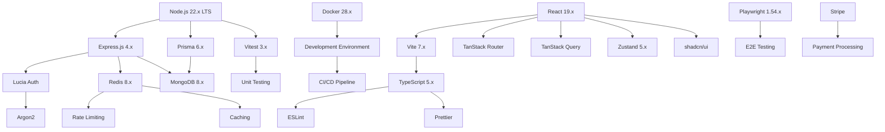

# D&D Encounter Tracker Implementation Plan

**Version:** 5.0  
**Date:** July 2025  
**Duration:** 10 weeks to production launch  
**Architecture:** Modern Express/React with Prisma ORM

## Table of Contents

### 🎯 Quick Navigation

- [🚨 Critical Dependencies](#critical-dependencies)
- [⚡ Phase-by-Phase Execution](#execution-roadmap)
- [🔄 Cross-Phase Dependencies](#cross-phase-dependencies)
- [🎲 Core Features Reference](#core-features-reference)
- [🔧 Technology Stack Quick Ref](#technology-stack-quick-reference)

### 📋 Main Sections

1. [Executive Summary](#executive-summary)
2. [Project Overview](#project-overview)
3. [Architecture & Technology Decisions](#architecture--technology-decisions)
4. [Development Standards & Best Practices](#development-standards--best-practices)
5. [Project Setup & Infrastructure](#project-setup--infrastructure)
6. [Phase 1: Foundation & Core Systems](#phase-1-foundation--core-systems)
7. [Phase 2: Core Features Implementation](#phase-2-core-features-implementation)
8. [Phase 3: Advanced Features & Monetization](#phase-3-advanced-features--monetization)
9. [Phase 4: Production Launch & Optimization](#phase-4-production-launch--optimization)
10. [Mobile-First UI Design Patterns](#mobile-first-ui-design-patterns)
11. [Onboarding for New Engineers & AI Agents](#onboarding-for-new-engineers--ai-agents)
12. [Testing Strategy](#testing-strategy)
13. [Quality Assurance & Monitoring](#quality-assurance--monitoring)
14. [Success Metrics](#success-metrics)

### 📊 Quick Reference Sections

- [GitHub Issues Index](#github-issues-index)
- [Technology Dependencies Map](#technology-dependencies-map)
- [Implementation Timeline](#implementation-timeline)

## Executive Summary

This implementation plan outlines the development of a modern D&D Encounter
Tracker using Express.js and React, designed as a clean slate implementation
that ignores existing code structures. The plan emphasizes modern development
practices, comprehensive testing, mobile-first design, and a robust onboarding
process for new team members.

### Key Objectives

- Build a production-ready application with 99.9% uptime capability
- Implement modern mobile-first design patterns for optimal UX
- Create comprehensive documentation and onboarding processes
- Establish best practices for testing, security, and performance
- Enable rapid onboarding of new engineers and AI agents

## Project Overview

### Core Features {#core-features-reference}

- **Initiative Tracking**: Advanced turn management with dexterity tiebreakers → [Phase 2](#phase-2-core-features-implementation)
- **HP & AC Management**: Real-time damage/healing tracking with conditions → [Week 5](#week-5-combat-system-core)
- **Character Management**: Support for multiclass characters and detailed stats → [Week 3](#week-3-character--party-management)
- **Encounter Building**: Flexible participant organization with templates → [Week 4](#week-4-encounter-building-system)
- **Lair Actions**: Automated initiative-20 lair action prompts (unique advantage) → [Lair Actions Implementation](#day-32-33-lair-actions-system)
- **Real-time Collaboration**: Live updates during combat sessions → [Real-time Infrastructure](#day-10-11-real-time-infrastructure)
- **Subscription Model**: 5-tier freemium monetization strategy → [Week 6](#week-6-subscription--payment-system)

### Unique Competitive Advantages

1. **Lair Actions Automation**: Only tracker with automated lair action management
2. **Mobile-First Design**: Optimized for tablet/phone use during sessions
3. **Real-time Collaboration**: Multiple DMs can co-manage encounters
4. **Offline Capability**: Full PWA with offline combat support
5. **Advanced Analytics**: Combat insights and performance metrics

## Architecture & Technology Decisions

### Why Express/React Over Next.js

**Express.js Benefits:**

- Complete control over authentication and session management
- Explicit middleware chain for easier debugging
- Backend portability - API can serve any frontend framework
- No vendor lock-in for deployment options
- Fine-grained performance optimization control

**React + Vite Benefits:**

- Lightning-fast development experience with HMR
- Optimal bundle splitting and code optimization
- Full control over build process and dependencies
- Better PWA implementation flexibility

### Modern Stack Selection {#technology-stack-quick-reference}

**Backend Technologies:**

- **Express.js 4.x**: Mature, stable API framework → [Authentication Foundation](#day-3-4-authentication-foundation)
- **Prisma 6.x**: Type-safe ORM with excellent MongoDB support → [Database Setup](#database--orm-setup)
- **Lucia Auth**: Modern session-based authentication → [Security Implementation](#security-implementation)
- **MongoDB 8.x**: Document database with 32% performance improvements → [Project Setup](#project-setup--infrastructure)
- **Redis 8.x**: Mandatory for production rate limiting and caching → [Rate Limiting](#rate-limiting--performance)
- **Argon2**: Industry-standard password hashing → [Security Standards](#security-standards)

**Frontend Technologies:**

- **React 19.x**: Latest stable with React Compiler optimizations → [React Application Setup](#day-8-9-react-application-setup)
- **Vite 7.x**: Next-generation build tool (requires Node.js 20.19+) → [Frontend Foundation](#frontend-foundation)
- **TanStack Router**: Fully type-safe routing with React 19 support → [State Management](#state-management)
- **TanStack Query 5.x**: Powerful server state management → [State Management](#state-management)
- **Zustand 5.x**: Lightweight client state management → [State Management](#state-management)
- **shadcn/ui**: Modern, accessible component library → [Mobile-First Design](#mobile-first-ui-design-patterns)

**Infrastructure & DevOps:**

- **Node.js 22.x LTS**: Maximum compatibility and stability → [Prerequisites](#prerequisites)
- **Docker 28.x**: Containerization with CDI support → [Development Environment Setup](#development-environment-setup)
- **TypeScript 5.x**: Strict mode enabled throughout → [Code Quality Standards](#code-quality-standards)
- **Vitest 3.x**: Fast unit testing with Vite integration → [Testing Infrastructure](#day-12-14-testing-infrastructure)
- **Playwright 1.54.x**: E2E testing for all major browsers → [Testing Strategy](#testing-strategy)

## Development Standards & Best Practices

### Code Quality Standards

**TypeScript Configuration:**

- Strict mode enabled across all packages
- No `any` types allowed in production code
- Consistent import/export patterns using ES modules
- Comprehensive type coverage (>95%)

**Code Organization:**

- Service layer pattern with dependency injection
- Repository pattern for data access
- Clean architecture with proper separation of concerns
- No files exceeding 450 lines of uncommented code
- Functions limited to 50 lines maximum

**Testing Requirements:**

- 80%+ test coverage for all modified code → [Testing Infrastructure](#day-12-14-testing-infrastructure)
- Test-Driven Development (TDD) for new features → [Testing Strategy](#testing-strategy)
- Unit tests for business logic → [Vitest Configuration](#vitest-configuration)
- Integration tests for API endpoints → [API Foundation](#api-foundation)
- E2E tests for critical user flows → [Comprehensive Testing](#comprehensive-testing)

### Security Standards

**Authentication & Authorization:**

- Session-based authentication with Lucia → [Day 3-4](#day-3-4-authentication-foundation)
- Argon2 password hashing with recommended parameters → [Security Implementation](#security-implementation)
- Account lockout after 5 failed login attempts → [Authentication Endpoints](#authentication-endpoints)
- CSRF protection on all state-changing operations → [Security Implementation](#security-implementation)
- Secure session cookies with proper flags → [Security Implementation](#security-implementation)

**Rate Limiting:**

- Redis-backed rate limiting (mandatory for production) → [Day 5-7](#day-5-7-core-infrastructure)
- Tier-based API limits based on subscription → [Day 38-39](#day-38-39-feature-gating--usage-limits)
- Strict IP-based limits for authentication endpoints → [Rate Limiting & Performance](#rate-limiting--performance)
- Application fails on startup if Redis unavailable in production → [Production Environment](#production-environment)

**Data Protection:**

- Input validation with Zod schemas → [API Foundation](#api-foundation)
- SQL injection prevention through Prisma → [Database & ORM Setup](#database--orm-setup)
- XSS protection with proper output encoding → [Security Headers](#security-headers)
- Security headers via Helmet.js → [Day 3-4](#day-3-4-authentication-foundation)
- Regular dependency vulnerability scanning → [Security Monitoring](#security-monitoring)

## Project Setup & Infrastructure

### Monorepo Structure

```text
dnd-tracker-express/
├── packages/
│   ├── server/                 # Express backend
│   │   ├── src/
│   │   │   ├── config/         # Configuration management
│   │   │   ├── controllers/    # HTTP request handlers
│   │   │   ├── services/       # Business logic layer
│   │   │   ├── repositories/   # Data access layer
│   │   │   ├── middleware/     # Express middleware
│   │   │   ├── routes/         # API route definitions
│   │   │   ├── lib/            # Utilities and integrations
│   │   │   ├── types/          # TypeScript type definitions
│   │   │   └── prisma/         # Database schema and migrations
│   │   ├── tests/              # Backend test suites
│   │   ├── Dockerfile          # Container configuration
│   │   └── package.json
│   │
│   ├── client/                 # React frontend
│   │   ├── src/
│   │   │   ├── components/     # React components
│   │   │   │   ├── ui/         # shadcn/ui components
│   │   │   │   ├── forms/      # Form components
│   │   │   │   ├── layout/     # Layout components
│   │   │   │   └── combat/     # Combat-specific components
│   │   │   ├── pages/          # Page components
│   │   │   ├── hooks/          # Custom React hooks
│   │   │   ├── services/       # API service layer
│   │   │   ├── stores/         # Zustand state stores
│   │   │   ├── lib/            # Utility functions
│   │   │   └── types/          # TypeScript types
│   │   ├── public/             # Static assets
│   │   ├── tests/              # Frontend tests
│   │   ├── vite.config.ts      # Vite configuration
│   │   ├── Dockerfile          # Container configuration
│   │   └── package.json
│   │
│   └── shared/                 # Shared types and utilities
│       ├── src/
│       │   ├── types/          # Shared TypeScript types
│       │   ├── schemas/        # Zod validation schemas
│       │   ├── constants/      # Shared constants
│       │   └── utils/          # Shared utility functions
│       └── package.json
│
├── docker/                     # Docker configurations
├── scripts/                    # Build and deployment scripts
├── docs/                       # Documentation
├── .github/                    # GitHub Actions workflows
├── docker-compose.yml          # Local development environment
├── package.json                # Root package configuration
├── turbo.json                  # Turborepo configuration
└── README.md                   # Project documentation
```

### Development Environment Setup

**Prerequisites:**

- Node.js 22.15.0 LTS (via nvm recommended)
- Docker Desktop for local services
- MongoDB Atlas account (production) / Local MongoDB (development)
- Redis Cloud account (production) / Local Redis (development)
- Stripe account for payment processing

**Initial Setup Commands:**

```bash
# Clone and setup project
git clone https://github.com/<your-org>/dnd-tracker-express.git
cd dnd-tracker-express
npm install

# Start local services
docker-compose up -d

# Setup databases
npm run db:reset
npm run db:seed

# Start development servers
npm run dev
```

## Phase 1: Foundation & Core Systems

**Duration:** Week 1-2  
**Objective:** Establish robust foundation with security and performance

### Week 1: Project Foundation

#### Day 1-2: Project Initialization

Infrastructure Tasks:

- Set up monorepo with npm workspaces ([#67](https://github.com/dougis/dnd-tracker-node/issues/67))
- Configure TypeScript with strict mode across all packages
- Set up ESLint with security plugins and consistent rules ([#65](https://github.com/dougis/dnd-tracker-node/issues/65), [#42](https://github.com/dougis/dnd-tracker-node/issues/42))
- Configure Prettier for consistent code formatting
- Create Docker Compose for local development services ([#68](https://github.com/dougis/dnd-tracker-node/issues/68))
- Set up GitHub Actions for CI/CD pipeline ([#41](https://github.com/dougis/dnd-tracker-node/issues/41))

Database & ORM Setup:

- Design and implement complete Prisma schema ([#66](https://github.com/dougis/dnd-tracker-node/issues/66))
- Create database migration scripts
- Implement database seeding with creature templates
- Set up connection pooling and optimization
- Configure database monitoring and health checks

#### Day 3-4: Authentication Foundation

Security Implementation:

- Implement Lucia Auth with secure session management
- Create password hashing with Argon2
- Build account lockout mechanism (5 failed attempts)
- Implement CSRF protection middleware
- Set up security headers with Helmet.js

Authentication Endpoints:

- `POST /api/v1/auth/register` - User registration with validation
- `POST /api/v1/auth/login` - Login with lockout protection
- `POST /api/v1/auth/logout` - Secure session termination
- `GET /api/v1/auth/session` - Session validation
- `POST /api/v1/auth/refresh` - Session refresh logic

#### Day 5-7: Core Infrastructure

Rate Limiting & Performance:

- Implement Redis-backed rate limiting with tier support ([#17](https://github.com/dougis/dnd-tracker-node/issues/17))
- Create multi-layer caching strategy (memory + Redis)
- Set up structured logging with Pino ([#69](https://github.com/dougis/dnd-tracker-node/issues/69))
- Implement performance monitoring middleware ([#71](https://github.com/dougis/dnd-tracker-node/issues/71))
- Configure error handling and reporting

API Foundation:

- Create consistent API response format ([#70](https://github.com/dougis/dnd-tracker-node/issues/70))
- Implement request validation with Zod
- Set up route structure and middleware chain
- Create health check endpoints
- Implement request ID tracking for debugging

### Week 2: Frontend Foundation & Real-time Infrastructure

#### Day 8-9: React Application Setup

Frontend Foundation:

- Set up React with Vite and TypeScript ([#21](https://github.com/dougis/dnd-tracker-node/issues/21))
- Configure TanStack Router with type-safe routes
- Implement authentication state management
- Create base component library with shadcn/ui
- Set up dark mode support and theming

State Management:

- Configure Zustand stores for client state
- Set up TanStack Query for server state
- Implement optimistic updates for combat actions
- Create error boundary components
- Set up loading state management

#### Day 10-11: Real-time Infrastructure

Server-Sent Events Implementation:

- Create SSE endpoint for encounter streaming ([#16](https://github.com/dougis/dnd-tracker-node/issues/16))
- Implement Redis pub/sub for multi-instance support ([#16](https://github.com/dougis/dnd-tracker-node/issues/16))
- Build connection management with heartbeat
- Create client-side SSE hooks with reconnection ([#16](https://github.com/dougis/dnd-tracker-node/issues/16))
- Implement event type system for different updates

Progressive Web App Setup:

- Configure service worker with Workbox ([#35](https://github.com/dougis/dnd-tracker-node/issues/35))
- Implement offline capability for core features ([#35](https://github.com/dougis/dnd-tracker-node/issues/35))
- Set up background sync for combat actions
- Create app manifest with proper icons
- Implement push notification foundation

#### Day 12-14: Testing Infrastructure

Testing Framework Setup:

- Configure Vitest for unit testing with coverage
- Set up Playwright for E2E testing
- Create test database and data factories
- Implement authentication test helpers
- Set up continuous integration testing

Quality Assurance Tools:

- Configure code coverage reporting ([#41](https://github.com/dougis/dnd-tracker-node/issues/41))
- Set up automated security scanning
- Implement performance testing framework
- Create accessibility testing pipeline
- Set up dependency vulnerability scanning

## Phase 2: Core Features Implementation

**Duration:** Week 3-5  
**Objective:** Build essential D&D encounter management features

### Week 3: Character & Party Management

#### Day 15-16: Character System

Character Model Implementation:

- Create character creation with multiclass support
- Implement ability score calculation and modifiers
- Build equipment and spell management
- Create character import/export functionality ([#72](https://github.com/dougis/dnd-tracker-node/issues/72))
- Implement character validation and constraints

Character UI Components:

- Character creation wizard with step-by-step flow ([#25](https://github.com/dougis/dnd-tracker-node/issues/25))
- Character sheet view with editing capabilities
- Quick-edit combat stats interface
- Character list with search and filtering
- Mobile-optimized character cards ([#76](https://github.com/dougis/dnd-tracker-node/issues/76))

#### Day 17-18: Party Management

Party System:

- Create party CRUD operations with proper validation ([#24](https://github.com/dougis/dnd-tracker-node/issues/24))
- Implement party member management
- Build party templates and duplication
- Create party sharing and collaboration features
- Implement party archiving and organization

Party UI Implementation:

- Party dashboard with member overview ([#25](https://github.com/dougis/dnd-tracker-node/issues/25))
- Drag-and-drop party organization
- Bulk operations for party management
- Party creation wizard
- Mobile-friendly party management interface

#### Day 19-21: Data Import & Templates

Import System:

- Create D&D Beyond character import ([#72](https://github.com/dougis/dnd-tracker-node/issues/72))
- Implement JSON character import/export
- Build creature template management ([#73](https://github.com/dougis/dnd-tracker-node/issues/73))
- Create custom creature builder
- Implement bulk import capabilities

Template Management:

- System creature templates with seeding
- User custom creature templates
- Template sharing and marketplace foundation ([#73](https://github.com/dougis/dnd-tracker-node/issues/73))
- Template versioning and updates
- Search and filtering for templates

### Week 4: Encounter Building System

#### Day 22-24: Encounter Management

Encounter System:

- Create encounter CRUD with participant management ([#26](https://github.com/dougis/dnd-tracker-node/issues/26))
- Implement encounter templates and scenarios
- Build encounter difficulty calculation
- Create encounter sharing capabilities
- Implement encounter history and analytics

Encounter Builder UI:

- Drag-and-drop encounter builder interface ([#27](https://github.com/dougis/dnd-tracker-node/issues/27))
- Party integration with one-click addition
- Creature search and addition system
- Encounter balance calculator
- Mobile-optimized encounter creation

#### Day 25-26: Participant Management

Participant System:

- Create participant model with flexible typing
- Implement initiative calculation with dex tiebreakers ([#74](https://github.com/dougis/dnd-tracker-node/issues/74))
- Build condition management system ([#75](https://github.com/dougis/dnd-tracker-node/issues/75))
- Create participant customization options
- Implement participant grouping and organization

Participant UI:

- Participant cards with inline editing
- Bulk operations for participant management
- Condition application and tracking interface
- Initiative order visualization
- Mobile-friendly participant interaction ([#76](https://github.com/dougis/dnd-tracker-node/issues/76))

#### Day 27-28: Pre-Combat Features

Pre-Combat Setup:

- Initiative rolling with automatic sorting
- Pre-combat character preparation
- Environment and terrain setup
- Surprise round management
- Combat start validation and checks

UI Implementation:

- Initiative rolling interface with animations
- Pre-combat checklist and validation
- Combat setup wizard
- Mobile-optimized setup flow
- Accessibility considerations for all interfaces

### Week 5: Combat System Core

#### Day 29-31: Combat Engine

Combat Logic:

- Turn and round management system
- HP tracking with damage/healing calculations
- Temporary HP management
- Death saves and unconsciousness handling
- Combat state persistence and recovery

Real-time Combat Updates:

- Live HP updates across all connected clients
- Initiative order changes with real-time sync
- Turn progression with automatic notifications
- Combat action broadcasting
- Conflict resolution for simultaneous edits

#### Day 32-33: Lair Actions System

Lair Actions Implementation:

- Automatic initiative-20 lair action prompts ([#12](https://github.com/dougis/dnd-tracker-node/issues/12))
- Customizable lair action templates
- Lair action automation and triggers
- Integration with encounter builder
- Lair action history and logging

Lair Actions UI:

- Lair action configuration interface
- Real-time lair action prompts during combat
- Lair action template library
- Mobile-optimized lair action management
- Accessibility features for lair actions

#### Day 34-35: Combat Interface

Combat Tracker UI:

- Initiative tracker with drag-and-drop reordering ([#27](https://github.com/dougis/dnd-tracker-node/issues/27))
- HP/damage tracking with quick buttons
- Condition management with visual indicators
- Turn timer and combat clock
- Combat log with action history

Mobile Combat Interface:

- Touch-optimized combat controls ([#76](https://github.com/dougis/dnd-tracker-node/issues/76))
- Gesture-based HP adjustment ([#76](https://github.com/dougis/dnd-tracker-node/issues/76))
- Quick access to common actions
- Streamlined mobile layout
- Offline combat capability

## Phase 3: Advanced Features & Monetization

**Duration:** Week 6-7  
**Objective:** Implement subscription system and advanced features

### Week 6: Subscription & Payment System

#### Day 36-37: Stripe Integration

Payment System:

- Stripe checkout session creation ([#14](https://github.com/dougis/dnd-tracker-node/issues/14))
- Webhook handling with idempotency protection
- Subscription lifecycle management
- Customer portal integration
- Payment failure handling and retry logic

Subscription Management:

- Tier-based feature gating middleware ([#28](https://github.com/dougis/dnd-tracker-node/issues/28))
- Usage tracking and limit enforcement ([#28](https://github.com/dougis/dnd-tracker-node/issues/28), [#40](https://github.com/dougis/dnd-tracker-node/issues/40))
- Subscription upgrade/downgrade flows
- Billing cycle management with automated resets
- Grace period handling for failed payments

#### Day 38-39: Feature Gating & Usage Limits

Usage Limit System:

- Daily usage reset job with node-cron ([#40](https://github.com/dougis/dnd-tracker-node/issues/40))
- Real-time usage tracking and validation
- Soft and hard limit enforcement
- Usage analytics and reporting
- Upgrade prompts and conversion optimization

Subscription Tiers Implementation:

- FREE: 1 party, 3 encounters, 6 participants max
- SEASONED: 3 parties, 15 encounters, cloud sync
- EXPERT: 10 parties, 50 encounters, collaboration
- MASTER: 25 parties, 100 encounters, API access
- GUILD: Unlimited parties, encounters, & creatures, 50 participants max,
  priority support

#### Day 40-42: Premium Features

Advanced Features:

- Combat analytics and performance insights ([#79](https://github.com/dougis/dnd-tracker-node/issues/79))
- Custom themes and branding options
- Advanced export capabilities (PDF, JSON, etc.)
- API access for third-party integrations ([#80](https://github.com/dougis/dnd-tracker-node/issues/80))
- Priority customer support system ([#81](https://github.com/dougis/dnd-tracker-node/issues/81))

Premium UI Components:

- Analytics dashboard with charts and metrics ([#79](https://github.com/dougis/dnd-tracker-node/issues/79))
- Theme customization interface
- Export wizard with format options
- API documentation and key management
- Subscription management dashboard ([#15](https://github.com/dougis/dnd-tracker-node/issues/15))

### Week 7: Advanced Combat & Collaboration

#### Day 43-44: Advanced Combat Features

Enhanced Combat System:

- Legendary actions with automatic prompts ([#77](https://github.com/dougis/dnd-tracker-node/issues/77))
- Spell slot tracking and management ([#78](https://github.com/dougis/dnd-tracker-node/issues/78))
- Advanced condition effects and automation
- Combat encounter statistics and analysis
- Custom combat rules and house rules support

Combat Analytics:

- Turn duration tracking and analysis ([#79](https://github.com/dougis/dnd-tracker-node/issues/79))
- Damage dealt/received statistics ([#79](https://github.com/dougis/dnd-tracker-node/issues/79))
- Combat difficulty post-analysis
- Player engagement metrics ([#79](https://github.com/dougis/dnd-tracker-node/issues/79))
- Encounter balance recommendations

#### Day 45-46: Collaboration Features

Real-time Collaboration:

- Shared encounter management
- Multiple DM support with role management
- Real-time collaborative editing ([#39](https://github.com/dougis/dnd-tracker-node/issues/39))
- Permission management system
- Activity logging and audit trails

Collaboration UI:

- User presence indicators
- Collaborative cursors and selections
- Real-time conflict resolution interface
- Permission management dashboard
- Activity feed and notifications

#### Day 47-49: Export & Integration

Export System:

- PDF export for encounters and characters
- JSON export for data portability
- CSV export for spreadsheet analysis
- Print-friendly encounter sheets
- Batch export capabilities

Integration Foundations:

- REST API for third-party access ([#80](https://github.com/dougis/dnd-tracker-node/issues/80))
- Webhook system for external notifications
- D&D Beyond integration framework ([#33](https://github.com/dougis/dnd-tracker-node/issues/33))
- Discord bot foundation
- Roll20 compatibility layer

## Phase 4: Production Launch & Optimization

**Duration:** Week 8-10  
**Objective:** Production deployment, performance optimization, and launch

### Week 8: Performance & Security Hardening

#### Day 50-52: Performance Optimization

Database Optimization:

- Query optimization and indexing strategy
- Connection pooling configuration
- Database performance monitoring
- Aggregation pipeline optimization
- Cache invalidation strategy refinement

Frontend Optimization:

- Bundle size optimization and analysis
- Image optimization and lazy loading
- Code splitting and dynamic imports
- Service worker optimization
- Performance monitoring and Core Web Vitals

#### Day 53-54: Security Hardening

Security Audit:

- OWASP compliance verification ([#18](https://github.com/dougis/dnd-tracker-node/issues/18))
- Penetration testing and vulnerability assessment ([#18](https://github.com/dougis/dnd-tracker-node/issues/18))
- Security header configuration
- Input validation and sanitization review
- Rate limiting effectiveness testing

Monitoring Implementation:

- Comprehensive error tracking with Sentry
- Performance monitoring and alerting ([#71](https://github.com/dougis/dnd-tracker-node/issues/71))
- Security incident detection
- Custom dashboards and metrics
- Log aggregation and analysis

#### Day 55-56: Testing & Quality Assurance

Comprehensive Testing:

- Complete E2E test suite with critical user journeys
- Load testing and stress testing
- Security testing and vulnerability scans
- Cross-browser compatibility testing
- Mobile device testing on real devices

Quality Assurance:

- Accessibility audit and compliance (WCAG 2.1)
- Performance regression testing
- User acceptance testing with beta users
- Documentation review and updates
- Final code review and cleanup

### Week 9: Production Deployment

#### Day 57-58: Infrastructure Setup

Production Environment:

- Production server configuration and deployment
- SSL certificate setup and HTTPS enforcement
- CDN configuration for static assets
- Database backup and recovery setup
- Monitoring and alerting configuration

CI/CD Pipeline:

- Automated deployment pipeline
- Environment-specific configuration management
- Rollback procedures and disaster recovery
- Health check automation
- Performance monitoring integration

#### Day 59-60: Launch Preparation

Go-Live Checklist:

- Production environment validation
- Payment processing verification
- Security configuration confirmation
- Performance baseline establishment
- Support system preparation

Documentation:

- User documentation and help guides
- API documentation for developers
- Administrator documentation
- Troubleshooting guides
- FAQ and common issues

#### Day 61-63: Soft Launch & Monitoring

Soft Launch:

- Limited user beta with invitation system
- Real-time monitoring and issue resolution
- User feedback collection and analysis
- Performance optimization based on real usage
- Bug fixes and immediate improvements

Launch Activities:

- Marketing site updates and SEO optimization
- Social media presence establishment
- Community building (Discord, Reddit)
- Influencer outreach in D&D community
- Press release and media kit preparation

### Week 10: Full Launch & Growth

#### Day 64-66: Public Launch

Launch Execution:

- Public launch announcement and marketing campaign
- User acquisition and onboarding optimization
- Real-time support and issue resolution
- Performance monitoring and scaling
- Conversion optimization and A/B testing

Growth Features:

- Referral program implementation
- Social sharing and viral features
- Community features and user-generated content
- Integration partnerships and API adoption
- Content marketing and SEO optimization

#### Day 67-70: Post-Launch Optimization

Analytics & Optimization:

- User behavior analysis and funnel optimization
- Conversion rate optimization for subscriptions
- Feature usage analysis and prioritization
- Customer feedback integration and product iteration
- Growth strategy refinement and scaling preparation

Future Planning:

- Roadmap prioritization based on user data
- Technical debt assessment and planning
- Scaling strategy for infrastructure
- Team expansion planning
- Partnership and business development opportunities

## Mobile-First UI Design Patterns

### Design Philosophy

**Mobile-First Approach:**

- Design for smallest screen first, then scale up
- Touch-first interaction patterns
- Thumb-friendly button placement
- Optimized for single-hand use during gameplay

**Key Principles:**

- **Accessibility**: WCAG 2.1 AA compliance across all interfaces
- **Performance**: <3 second load time on 3G networks
- **Usability**: One-handed operation during D&D sessions
- **Consistency**: Unified design system across all platforms

### Mobile-Specific Patterns

**Navigation Patterns:**

- Bottom tab navigation for primary features
- Hamburger menu for secondary functions
- Breadcrumb navigation for deep hierarchy
- Swipe gestures for common actions

**Combat Interface Patterns:**

- Swipe left/right for HP adjustment
- Long press for detailed character sheets
- Pull-to-refresh for real-time updates
- Drag and drop for initiative reordering

**Form Patterns:**

- Progressive disclosure for complex forms
- Smart defaults and auto-completion
- Inline validation with helpful error messages
- Touch-optimized input controls

**Data Display Patterns:**

- Card-based layouts for scannable information
- Collapsible sections for optional details
- Progressive disclosure for advanced features
- Visual hierarchy with clear typography

### Responsive Breakpoints

```css
/* Mobile First Breakpoints */
$mobile: 320px;      /* Small phones */
$mobile-large: 414px; /* Large phones */
$tablet: 768px;      /* Tablets */
$tablet-large: 1024px; /* Large tablets */
$desktop: 1280px;    /* Small desktop */
$desktop-large: 1920px; /* Large desktop */
```

**Adaptive Features:**

- **Mobile (320-767px)**: Single column, bottom navigation, swipe gestures
- **Tablet (768-1279px)**: Two column, sidebar navigation, touch optimized
- **Desktop (1280px+)**: Multi-column, mouse optimization, keyboard shortcuts

### Offline Experience Design

**Offline-First Features:**

- Full combat tracking without internet connection
- Automatic sync when connection restored
- Clear offline indicators and status
- Conflict resolution for simultaneous edits

**PWA Implementation:**

- App-like experience with native feel
- Home screen installation prompts
- Push notifications for important events
- Background sync for pending actions

## Onboarding for New Engineers & AI Agents

### Quick Start Guide

**Prerequisites Check:**

```bash
# Verify required tools
node --version    # Should be 22.15.0 or higher
npm --version     # Should be 10.x or higher
docker --version  # Should be 28.x or higher
git --version     # Should be 2.x or higher
```

**One-Command Setup:**

```bash
# Clone and setup everything
git clone https://github.com/<your-org>/dnd-tracker-express.git dnd-tracker
cd dnd-tracker
npm run setup:dev
```

The `setup:dev` script handles:

- Installing all dependencies
- Starting Docker services
- Running database migrations
- Seeding test data
- Starting development servers

### Development Workflow

**Daily Development Cycle:**

1. **Start Development**: `npm run dev` - Starts all services
2. **Run Tests**: `npm run test:watch` - Continuous testing
3. **Code Quality**: `npm run lint:fix` - Auto-fix issues
4. **Type Check**: `npm run type-check` - Verify TypeScript
5. **Commit**: `npm run commit` - Guided commit with validation

**Feature Development Workflow:**

1. Create feature branch: `git checkout -b feature/your-feature`
2. Implement with TDD: Write tests first, then implementation
3. Run quality checks: `npm run quality:check`
4. Create PR: Automated checks must pass
5. Code review and merge

### Codebase Navigation

**Key Directories:**

- `packages/server/src/services/` - Business logic
- `packages/server/src/repositories/` - Data access
- `packages/client/src/components/` - UI components
- `packages/shared/src/types/` - Shared type definitions

**Important Files:**

- `packages/server/src/app.ts` - Express app configuration
- `packages/client/src/main.tsx` - React app entry point
- `packages/shared/src/schemas/` - Zod validation schemas
- `docs/TECHNICAL_DESIGN.md` - Architecture reference

### Testing Strategy

**Test Types & Requirements:**

- **Unit Tests**: 80%+ coverage, fast execution (<100ms each)
- **Integration Tests**: API endpoints and database operations
- **E2E Tests**: Critical user journeys and payment flows
- **Visual Tests**: Component screenshot comparisons

**Test Naming Convention:**

```typescript
// Pattern: [method/feature] should [expected behavior] when [condition]
describe('CombatService', () => {
  describe('updateParticipantHP', () => {
    it('should reduce current HP when damage is applied', async () => {
      // Test implementation
    });
    
    it('should not allow HP below zero when excessive damage applied',
       async () => {
      // Test implementation
    });
  });
});
```

**Test Data Management:**

- Use factories for consistent test data
- Clean database between test suites
- Mock external services (Stripe, email)
- Isolated test environments

### Common Development Tasks

**Adding a New API Endpoint:**

1. Define Zod schema in `packages/shared/src/schemas/`
2. Create repository method in `packages/server/src/repositories/`
3. Implement service logic in `packages/server/src/services/`
4. Create controller in `packages/server/src/controllers/`
5. Add route in `packages/server/src/routes/`
6. Write tests for all layers
7. Update API documentation

**Adding a New UI Component:**

1. Create component in `packages/client/src/components/`
2. Add to component library exports
3. Write Storybook stories for all variants
4. Implement unit tests with React Testing Library
5. Add to design system documentation
6. Test on multiple devices and browsers

**Database Schema Changes:**

1. Update Prisma schema in `packages/server/prisma/schema.prisma`
2. Generate migration: `npm run db:migrate:dev`
3. Update seed data if necessary
4. Update TypeScript types
5. Write migration tests
6. Document breaking changes

### AI Agent Integration

**AI-Friendly Code Organization:**

- Consistent file structure and naming conventions
- Comprehensive JSDoc documentation for all functions
- Clear separation of concerns between layers
- Standardized error handling patterns

**AI Development Assistance:**

- Context-rich code comments for complex business logic
- Type definitions serve as documentation
- Test files provide usage examples
- API documentation auto-generated from code

**AI Code Generation Guidelines:**

- Follow established patterns in existing codebase
- Use TypeScript strict mode (no `any` types)
- Include comprehensive error handling
- Write tests alongside implementation
- Follow security best practices

### Troubleshooting Guide

**Common Setup Issues:**

*Database Connection Failed:*

```bash
# Check MongoDB status
docker-compose ps
# Restart MongoDB
docker-compose restart mongodb
# Check connection string in .env
```

*Redis Connection Failed:*

```bash
# Check Redis status
docker-compose ps
# Restart Redis
docker-compose restart redis
# Verify Redis is mandatory in production
```

*TypeScript Errors:*

```bash
# Clear TypeScript cache
npm run type-check:clean
# Regenerate Prisma client
npm run db:generate
# Restart TypeScript server in IDE
```

*Test Failures:*

```bash
# Run tests in isolation
npm run test:unit
# Clear test database
npm run test:db:reset
# Check test environment variables
```

**Performance Debugging:**

- Use built-in performance monitoring middleware
- Check database query performance with Prisma logging
- Monitor bundle size with webpack-bundle-analyzer
- Use React DevTools Profiler for frontend performance

### Documentation Standards

**Code Documentation:**

- JSDoc for all public functions and classes
- Inline comments for complex business logic
- README files for each package
- API documentation auto-generated from code

**Architecture Documentation:**

- Keep technical design document updated
- Document architectural decisions and rationale
- Maintain database schema documentation
- Update deployment and infrastructure docs

**User Documentation:**

- Feature documentation with screenshots
- API documentation for developers
- Troubleshooting guides for common issues
- Video tutorials for complex workflows

## Quality Assurance & Monitoring

### Quality Assurance Standards

**Automated Quality Checks:**

- ESLint with TypeScript and security rules
- Prettier for consistent formatting
- TypeScript strict mode enforcement
- Automated dependency vulnerability scanning
- Code coverage reporting (80% minimum) ([#41](https://github.com/dougis/dnd-tracker-node/issues/41))

**Code Review Requirements:**

- All changes require peer review
- Automated tests must pass
- Performance impact assessment
- Security review for sensitive changes
- Documentation updates included

### Performance Monitoring

**Frontend Performance:**

- Core Web Vitals monitoring
- Bundle size tracking and alerts
- Real User Monitoring (RUM) with analytics
- Performance budgets and CI enforcement
- Lighthouse CI integration

**Backend Performance:**

- API response time monitoring
- Database query performance tracking
- Memory and CPU usage monitoring
- Error rate and availability tracking
- Custom business metrics (combat sessions, etc.)

### Security Monitoring

**Continuous Security:**

- Automated dependency scanning
- OWASP compliance verification
- Regular security audits
- Penetration testing (quarterly)
- Security incident response plan

**Monitoring & Alerting:**

- Failed authentication attempt monitoring
- Unusual payment activity detection
- Performance degradation alerts
- Error rate threshold alerts
- Security incident notifications

## Success Metrics

### Technical Metrics

**Performance Targets:**

- 99.9% uptime (8.76 hours downtime/year max)
- <2 second page load time (95th percentile)
- <500ms API response time (95th percentile)
- 80%+ test coverage across all packages
- Zero high-severity security vulnerabilities

**Quality Metrics:**

- Customer satisfaction >4.5/5
- Bug report rate <1% of user sessions
- Support ticket resolution <24 hours
- Mobile performance score >90 (Lighthouse)
- Accessibility score >95 (WAVE/axe)

### Business Metrics

**User Acquisition:**

- 1,000 registered users within first month
- 50% activation rate (complete first encounter)
- 10% conversion rate (free to paid)
- <5% monthly churn rate
- >$5,000 MRR within 3 months

**Product-Market Fit Indicators:**

- Net Promoter Score (NPS) >50
- 40%+ weekly active user retention
- Average session duration >15 minutes
- Feature adoption rate >60% for core features
- Organic growth rate >20% monthly

### Launch Milestones

#### Week 1-2: Foundation Complete

- ✅ Secure authentication system
- ✅ Real-time infrastructure working
- ✅ Mobile-responsive design
- ✅ Comprehensive testing suite
- ✅ Development workflow established

#### Week 3-5: Core Features Complete

- ✅ Character and party management
- ✅ Encounter building system
- ✅ Combat tracking with real-time updates
- ✅ Lair actions automation
- ✅ Mobile-optimized combat interface

#### Week 6-7: Monetization Ready

- ✅ Stripe payment integration
- ✅ Subscription tier enforcement
- ✅ Usage tracking and limits
- ✅ Premium features implemented
- ✅ Customer support system

#### Week 8-10: Production Launch

- ✅ Performance optimization complete
- ✅ Security hardening verified
- ✅ Production deployment successful
- ✅ Marketing campaign launched
- ✅ User acquisition targets met

## Conclusion

This comprehensive implementation plan provides a roadmap for building a
world-class D&D Encounter Tracker that prioritizes modern development
practices, mobile-first design, and seamless onboarding for new team members.
The plan emphasizes quality, security, and performance while building a
sustainable business model through thoughtful monetization.

The combination of Express.js and React provides a solid foundation for rapid
development while maintaining full control over authentication, performance,
and deployment options. The mobile-first design approach ensures the
application works excellently during actual D&D sessions, while the
comprehensive onboarding process enables rapid team scaling and AI agent
integration.

Success depends on consistent execution of the development standards,
continuous testing and monitoring, and a focus on delivering genuine value to
the D&D community through innovative features like automated lair actions and
real-time collaboration.

---

## Quick Reference Sections

### GitHub Issues Index

This section provides a comprehensive mapping of all GitHub issues referenced throughout the implementation plan, organized by category and phase for easy navigation.

**🏗️ Infrastructure & Setup**

- [#41](https://github.com/dougis/dnd-tracker-node/issues/41) - CI/CD Pipeline & Code Coverage → [Day 1-2](#day-1-2-project-initialization), [Testing Infrastructure](#day-12-14-testing-infrastructure)
- [#42](https://github.com/dougis/dnd-tracker-node/issues/42) - ESLint Configuration → [Day 1-2](#day-1-2-project-initialization)
- [#65](https://github.com/dougis/dnd-tracker-node/issues/65) - ESLint Security Rules → [Day 1-2](#day-1-2-project-initialization)
- [#67](https://github.com/dougis/dnd-tracker-node/issues/67) - Monorepo Setup → [Day 1-2](#day-1-2-project-initialization)
- [#68](https://github.com/dougis/dnd-tracker-node/issues/68) - Docker Configuration → [Day 1-2](#day-1-2-project-initialization)
- [#69](https://github.com/dougis/dnd-tracker-node/issues/69) - Structured Logging → [Day 5-7](#day-5-7-core-infrastructure)
- [#70](https://github.com/dougis/dnd-tracker-node/issues/70) - API Response Format → [API Foundation](#api-foundation)
- [#71](https://github.com/dougis/dnd-tracker-node/issues/71) - Performance Monitoring → [Day 5-7](#day-5-7-core-infrastructure), [Performance Optimization](#day-50-52-performance-optimization)

**💾 Database & Data Management**

- [#66](https://github.com/dougis/dnd-tracker-node/issues/66) - Prisma Schema → [Database & ORM Setup](#database--orm-setup)
- [#72](https://github.com/dougis/dnd-tracker-node/issues/72) - Character Import/Export → [Day 15-16](#day-15-16-character-system), [Day 19-21](#day-19-21-data-import--templates)
- [#73](https://github.com/dougis/dnd-tracker-node/issues/73) - Creature Templates → [Day 19-21](#day-19-21-data-import--templates)

**🔐 Authentication & Security**

- [#17](https://github.com/dougis/dnd-tracker-node/issues/17) - Redis Rate Limiting → [Day 5-7](#day-5-7-core-infrastructure)
- [#18](https://github.com/dougis/dnd-tracker-node/issues/18) - OWASP Security → [Day 53-54](#day-53-54-security-hardening)

**⚡ Real-time & Performance**

- [#16](https://github.com/dougis/dnd-tracker-node/issues/16) - Server-Sent Events → [Day 10-11](#day-10-11-real-time-infrastructure)
- [#35](https://github.com/dougis/dnd-tracker-node/issues/35) - PWA & Offline → [Progressive Web App Setup](#progressive-web-app-setup)

**🎮 Core Features**

- [#12](https://github.com/dougis/dnd-tracker-node/issues/12) - Lair Actions → [Day 32-33](#day-32-33-lair-actions-system)
- [#21](https://github.com/dougis/dnd-tracker-node/issues/21) - React Setup → [Day 8-9](#day-8-9-react-application-setup)
- [#24](https://github.com/dougis/dnd-tracker-node/issues/24) - Party Management → [Day 17-18](#day-17-18-party-management)
- [#25](https://github.com/dougis/dnd-tracker-node/issues/25) - Character UI → [Day 15-16](#day-15-16-character-system), [Day 17-18](#day-17-18-party-management)
- [#26](https://github.com/dougis/dnd-tracker-node/issues/26) - Encounter Management → [Day 22-24](#day-22-24-encounter-management)
- [#27](https://github.com/dougis/dnd-tracker-node/issues/27) - Encounter Builder UI → [Day 22-24](#day-22-24-encounter-management), [Day 34-35](#day-34-35-combat-interface)
- [#74](https://github.com/dougis/dnd-tracker-node/issues/74) - Initiative Calculation → [Day 25-26](#day-25-26-participant-management)
- [#75](https://github.com/dougis/dnd-tracker-node/issues/75) - Condition Management → [Day 25-26](#day-25-26-participant-management)
- [#76](https://github.com/dougis/dnd-tracker-node/issues/76) - Mobile UI → [Day 15-16](#day-15-16-character-system), [Day 25-26](#day-25-26-participant-management), [Day 34-35](#day-34-35-combat-interface)
- [#77](https://github.com/dougis/dnd-tracker-node/issues/77) - Legendary Actions → [Day 43-44](#day-43-44-advanced-combat-features)
- [#78](https://github.com/dougis/dnd-tracker-node/issues/78) - Spell Tracking → [Day 43-44](#day-43-44-advanced-combat-features)

**💰 Monetization & Business**

- [#14](https://github.com/dougis/dnd-tracker-node/issues/14) - Stripe Integration → [Day 36-37](#day-36-37-stripe-integration)
- [#15](https://github.com/dougis/dnd-tracker-node/issues/15) - Subscription Dashboard → [Day 40-42](#day-40-42-premium-features)
- [#28](https://github.com/dougis/dnd-tracker-node/issues/28) - Feature Gating → [Day 38-39](#day-38-39-feature-gating--usage-limits)
- [#40](https://github.com/dougis/dnd-tracker-node/issues/40) - Usage Tracking → [Day 38-39](#day-38-39-feature-gating--usage-limits)
- [#79](https://github.com/dougis/dnd-tracker-node/issues/79) - Analytics → [Day 40-42](#day-40-42-premium-features), [Day 43-44](#day-43-44-advanced-combat-features)
- [#80](https://github.com/dougis/dnd-tracker-node/issues/80) - API Access → [Day 40-42](#day-40-42-premium-features), [Day 47-49](#day-47-49-export--integration)
- [#81](https://github.com/dougis/dnd-tracker-node/issues/81) - Customer Support → [Day 40-42](#day-40-42-premium-features)

**🤝 Collaboration & Integration**

- [#33](https://github.com/dougis/dnd-tracker-node/issues/33) - D&D Beyond Integration → [Day 47-49](#day-47-49-export--integration)
- [#39](https://github.com/dougis/dnd-tracker-node/issues/39) - Real-time Collaboration → [Day 45-46](#day-45-46-collaboration-features)

### Technology Dependencies Map

This visual map shows how different technologies depend on each other throughout the implementation:



**Critical Path Dependencies:**

1. **Authentication Chain**: Node.js → Express.js → Lucia Auth → Argon2
2. **Database Chain**: Node.js → Prisma → MongoDB
3. **Rate Limiting Chain**: Redis → Rate Limiting Middleware → API Security
4. **Frontend Chain**: React → Vite → TypeScript → Component Library
5. **Testing Chain**: Vitest + Playwright → CI/CD → Quality Gates

### Implementation Timeline

**Cross-Phase Dependencies Visualization:**

| Week | Phase | Critical Dependencies | Blocks |
|------|-------|----------------------|---------|
| 1-2 | [Foundation](#phase-1-foundation--core-systems) | None | All other phases |
| 3-5 | [Core Features](#phase-2-core-features-implementation) | [Authentication](#day-3-4-authentication-foundation), [Database](#database--orm-setup) | [Monetization](#phase-3-advanced-features--monetization) |
| 6-7 | [Monetization](#phase-3-advanced-features--monetization) | [Core Features](#phase-2-core-features-implementation), [User Management](#day-15-16-character-system) | [Production](#phase-4-production-launch--optimization) |
| 8-10 | [Production](#phase-4-production-launch--optimization) | All previous phases | Launch |

**Key Milestone Dependencies:**

- **Real-time Features** depend on [SSE Infrastructure](#day-10-11-real-time-infrastructure)
- **Mobile Features** depend on [PWA Setup](#progressive-web-app-setup)
- **Payment Features** depend on [User System](#day-15-16-character-system) + [Subscription Tiers](#day-38-39-feature-gating--usage-limits)
- **Launch** depends on [Security Hardening](#day-53-54-security-hardening) + [Performance Optimization](#day-50-52-performance-optimization)

### Critical Dependencies {#critical-dependencies}

**🚨 Must Complete Before Any Other Work:**

1. [Monorepo Setup](#day-1-2-project-initialization) - Blocks all development
2. [Database Schema](#database--orm-setup) - Blocks all features
3. [Authentication System](#day-3-4-authentication-foundation) - Blocks user features
4. [Redis Setup](#rate-limiting--performance) - Required for production

### Execution Roadmap {#execution-roadmap}

**⚡ Phase-by-Phase Execution:**

1. **Week 1**: Complete [Foundation](#phase-1-foundation--core-systems) - enables parallel development
2. **Week 2**: Establish [Real-time Infrastructure](#day-10-11-real-time-infrastructure) - unblocks combat features  
3. **Week 3-4**: Build [Core Features](#phase-2-core-features-implementation) in parallel streams
4. **Week 5**: Integrate [Combat System](#week-5-combat-system-core) with real-time updates
5. **Week 6-7**: Layer on [Monetization](#phase-3-advanced-features--monetization) features
6. **Week 8-10**: [Production hardening](#phase-4-production-launch--optimization) and launch

### Cross-Phase Dependencies {#cross-phase-dependencies}

**🔄 Critical Dependency Chains:**

- [Real-time Infrastructure](#day-10-11-real-time-infrastructure) → [Combat System](#week-5-combat-system-core) → [Collaboration Features](#day-45-46-collaboration-features)
- [User System](#day-15-16-character-system) → [Subscription System](#day-36-37-stripe-integration) → [Feature Gating](#day-38-39-feature-gating--usage-limits)
- [Security Foundation](#day-3-4-authentication-foundation) → [Payment Integration](#day-36-37-stripe-integration) → [Production Launch](#day-57-58-infrastructure-setup)
